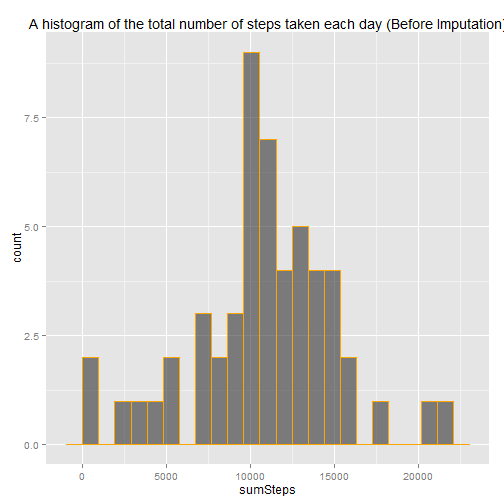
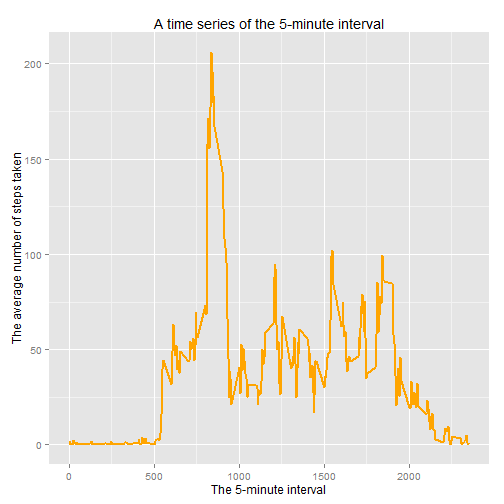
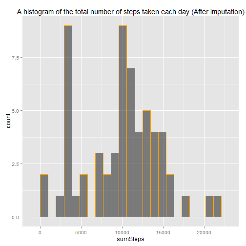
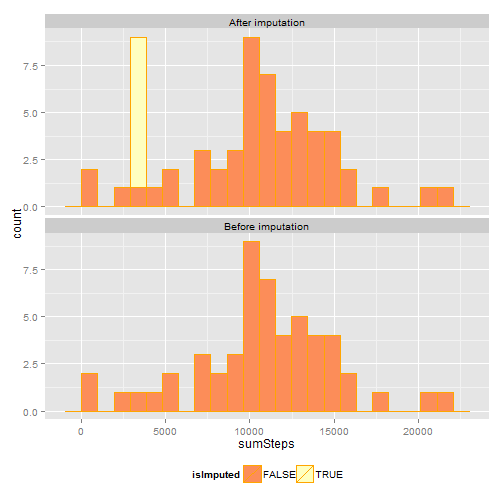
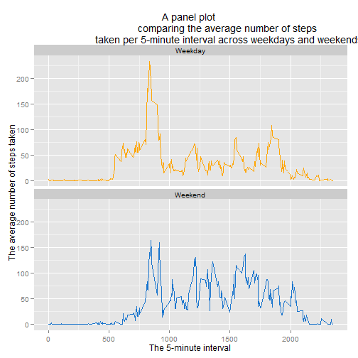
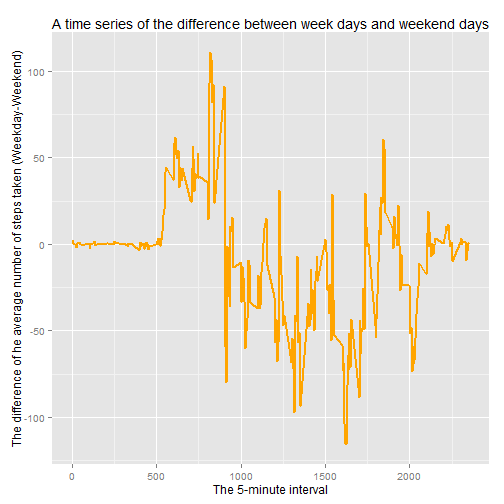

# Reproducible Research: Peer Assessment 1
========================================
## Introduction

This assignment makes use of data from a personal activity monitoring device. This device collects data at 5 minute intervals through out the day. The data consists of two months of data from an anonymous individual collected during the months of October and November, 2012 and include the number of steps taken in 5 minute intervals each day.


#### Data

The data for this assignment can be downloaded from the course web site:
* [Dataset: Activity monitoring data (52K)](https://d396qusza40orc.cloudfront.net/repdata%2Fdata%2Factivity.zip).
    

The variables included in this dataset are:

  * **steps**: Number of steps taking in a 5-minute interval (missing values are coded as NA)

  * **date**: The date on which the measurement was taken in YYYY-MM-DD format

  * **interval**: Identifier for the 5-minute interval in which measurement was taken

The dataset is stored in a comma-separated-value (CSV) file and there are a total of 17,568 observations in this dataset.

 

### Set System's settings

Set appropriate locale for US English.

```r
Sys.setlocale(category = "LC_ALL", locale = "English_United States.1252")
```

```
## [1] "LC_COLLATE=English_United States.1252;LC_CTYPE=English_United States.1252;LC_MONETARY=English_United States.1252;LC_NUMERIC=C;LC_TIME=English_United States.1252"
```


### Set Global Options for knit

```r
opts_chunk$set(echo = TRUE, results='markup' )
```

### Load packages

```r
#packages <- c("data.table", "ggplot2", "xtable", "VIM", "R.utils")
#sapply(packages, require, character.only=TRUE, quietly=TRUE)

require("data.table")
```

```
## Loading required package: data.table
```

```r
require("ggplot2")
```

```
## Loading required package: ggplot2
```

```r
require("xtable")
```

```
## Loading required package: xtable
```

```r
require("VIM")
```

```
## Loading required package: VIM
## Loading required package: colorspace
## Loading required package: grid
## VIM is ready to use. 
##  Since version 4.0.0 the GUI is in its own package VIMGUI.
## 
##           Please use the package to use the new (and old) GUI.
## 
## 
## Attaching package: 'VIM'
## 
## The following object is masked from 'package:datasets':
## 
##     sleep
```

```r
require("R.utils")
```

```
## Loading required package: R.utils
## Loading required package: R.oo
## Loading required package: R.methodsS3
## R.methodsS3 v1.6.1 (2014-01-04) successfully loaded. See ?R.methodsS3 for help.
## R.oo v1.18.0 (2014-02-22) successfully loaded. See ?R.oo for help.
## 
## Attaching package: 'R.oo'
## 
## The following objects are masked from 'package:methods':
## 
##     getClasses, getMethods
## 
## The following objects are masked from 'package:base':
## 
##     attach, detach, gc, load, save
## 
## R.utils v1.32.4 (2014-05-14) successfully loaded. See ?R.utils for help.
## 
## Attaching package: 'R.utils'
## 
## The following object is masked from 'package:utils':
## 
##     timestamp
## 
## The following objects are masked from 'package:base':
## 
##     cat, commandArgs, getOption, inherits, isOpen, parse, warnings
```

## Loading and preprocessing the data
> ### Loading and preprocessing the data
> 
> Show any code that is needed to
> 
> 1. Load the data (i.e. `read.csv()`)
> 
> 2. Process/transform the data (if necessary) into a format suitable for your analysis

#### <span style="color:orange">1. Load the data</span>
Download and Unzip the data file.


```r
fl <- "activity"
fl.csv <- paste0(fl, ".csv")
fl.zip <- paste0(fl, ".zip")
url<-"https://d396qusza40orc.cloudfront.net/repdata%2Fdata%2Factivity.zip"


if (file.exists(fl) == FALSE) {
    if (file.exists(fl.zip) == FALSE) {
        download.file(url, destfile = fl.zip, method = "curl",
                      quiet = TRUE)    
    }
    
    unzip(fl.zip)
}
```
Read the CSV file and then by using the [`data.table`](http://cran.r-project.org/web/packages/data.table/index.html) package convert the data frame to a data table (since data.table operations are very fast).


```r
dt <- read.csv(file.path(getwd(), "activity.csv"))
dt <- data.table(dt)
```
#### <span style="color:orange">2. Process/transform the data</span>
Verify that the number of rows (i.e. the number of observations) in the dataset is the expected value of 17,568.


```r
n_row <- nrow(dt)
```
The number of rows in the dataset is <span style="color:orange">``17568``</sapn>.

```r
check <- n_row == 17568
if (check == FALSE) stop("The number of rows in the dataset is not 17,568.")
```
Convert the `date` variable to a  **date class**, create key on a data table and
using the [`data.table`](http://cran.r-project.org/web/packages/data.table/index.html) package,
look at the structure of the dataset, and some first and last parts of the table.


```r
dt <- dt[, date := as.Date(date)]
setkey(dt, date, interval)
str(dt)
```

```
## Classes 'data.table' and 'data.frame':	17568 obs. of  3 variables:
##  $ steps   : int  NA NA NA NA NA NA NA NA NA NA ...
##  $ date    : Date, format: "2012-10-01" "2012-10-01" ...
##  $ interval: int  0 5 10 15 20 25 30 35 40 45 ...
##  - attr(*, ".internal.selfref")=<externalptr> 
##  - attr(*, "sorted")= chr  "date" "interval"
```

```r
summary(dt)
```

```
##      steps            date               interval   
##  Min.   :  0.0   Min.   :2012-10-01   Min.   :   0  
##  1st Qu.:  0.0   1st Qu.:2012-10-16   1st Qu.: 589  
##  Median :  0.0   Median :2012-10-31   Median :1178  
##  Mean   : 37.4   Mean   :2012-10-31   Mean   :1178  
##  3rd Qu.: 12.0   3rd Qu.:2012-11-15   3rd Qu.:1766  
##  Max.   :806.0   Max.   :2012-11-30   Max.   :2355  
##  NA's   :2304
```

```r
dt
```

```
##        steps       date interval
##     1:    NA 2012-10-01        0
##     2:    NA 2012-10-01        5
##     3:    NA 2012-10-01       10
##     4:    NA 2012-10-01       15
##     5:    NA 2012-10-01       20
##    ---                          
## 17564:    NA 2012-11-30     2335
## 17565:    NA 2012-11-30     2340
## 17566:    NA 2012-11-30     2345
## 17567:    NA 2012-11-30     2350
## 17568:    NA 2012-11-30     2355
```

## What is mean total number of steps taken per day?
> For this part of the assignment, you can ignore the missing values in
> the dataset.
> 
> 1. Make a histogram of the total number of steps taken each day
> 
> 2. Calculate and report the **mean** and **median** total number of steps taken per day

Aggregate the number of steps taken each day.
Since we ignore the missing values, days with missing values (`NA`) will have `NA` when aggregated.


```r
dtDaily <- dt[, list(sumSteps = sum(steps, na.rm = FALSE)), date]
head(dtDaily)
```

```
##          date sumSteps
## 1: 2012-10-01       NA
## 2: 2012-10-02      126
## 3: 2012-10-03    11352
## 4: 2012-10-04    12116
## 5: 2012-10-05    13294
## 6: 2012-10-06    15420
```

#### <span style="color:orange">1. Plot a histogram of the total number of steps taken each day.</sapan>


```r
bin_width <- round(0.05*max(dtDaily$sumSteps, na.rm = TRUE))
  

figure <- ggplot(dtDaily, aes(x=sumSteps))
figure <- figure +   geom_histogram( alpha=0.6,binwidth=960, colour = 'orange', size = 0.1)
figure + ggtitle("A histogram of the total number of steps taken each day (Before Imputation)")
```

 

#### <span style="color:orange"> 2. Calculate the mean and median total number of steps taken per day</span>
Since  
> for this part of the assignment, we can ignore the missing values in
> the dataset  

  note that <span style="color:red"> these computations have been done *before imputing* for missing data</span>.


```r
tab <- dtDaily[, list(n = .N, nValid = sum(!is.na(sumSteps)), 
                      mean = mean(sumSteps, na.rm=TRUE), 
                      median = median(sumSteps, na.rm=TRUE))]
print(xtable(tab), type="html", include.rownames=FALSE)
```

<!-- html table generated in R 3.1.1 by xtable 1.7-3 package -->
<!-- Sat Aug 09 17:26:43 2014 -->
<TABLE border=1>
<TR> <TH> n </TH> <TH> nValid </TH> <TH> mean </TH> <TH> median </TH>  </TR>
  <TR> <TD align="right">  61 </TD> <TD align="right">  53 </TD> <TD align="right"> 10766.19 </TD> <TD align="right"> 10765 </TD> </TR>
   </TABLE>
As we can read from a table the mean and median total number of steps taken per day are <span style="color:orange"> ``10766``</span> and <span style="color:orange"> ``10765`` </span> respectively.

## What is the average daily activity pattern?

> 1. Make a time series plot (i.e. `type = "l"`) of the 5-minute interval (x-axis) and the average number of steps taken, averaged across all days (y-axis)
> 2. Which 5-minute interval, on average across all the days in the dataset, contains the maximum number of steps?

#### <span style="color:orange">1. Make a time series plot</span>

Aggregate the average number of steps taken by 5-minute interval.


```r
dtInt <- dt[, list(meanSteps = mean(steps, na.rm=TRUE)), interval]
str(dtInt)
```

```
## Classes 'data.table' and 'data.frame':	288 obs. of  2 variables:
##  $ interval : int  0 5 10 15 20 25 30 35 40 45 ...
##  $ meanSteps: num  1.717 0.3396 0.1321 0.1509 0.0755 ...
##  - attr(*, ".internal.selfref")=<externalptr>
```

```r
summary(dtInt)
```

```
##     interval      meanSteps     
##  Min.   :   0   Min.   :  0.00  
##  1st Qu.: 589   1st Qu.:  2.49  
##  Median :1178   Median : 34.11  
##  Mean   :1178   Mean   : 37.38  
##  3rd Qu.:1766   3rd Qu.: 52.83  
##  Max.   :2355   Max.   :206.17
```

```r
dtInt
```

```
##      interval meanSteps
##   1:        0   1.71698
##   2:        5   0.33962
##   3:       10   0.13208
##   4:       15   0.15094
##   5:       20   0.07547
##  ---                   
## 284:     2335   4.69811
## 285:     2340   3.30189
## 286:     2345   0.64151
## 287:     2350   0.22642
## 288:     2355   1.07547
```
Plot a time series of the 5-minute interval and the average number of steps taken across all days.


```r
figure <- ggplot(dtInt, aes(x=interval, y=meanSteps))
figure <- figure + geom_line(color="orange", size=1)
figure <- figure + ggtitle("A time series of the 5-minute interval") 
figure + xlab("The 5-minute interval") + ylab("The average number of steps taken")
```

 

#### <span style="color:orange">2. Which 5-minute interval, on average across all the days in the dataset, contains the maximum number of steps?</span>

```r
max_meanSteps <- max(dtInt$meanSteps)
max_dtInt <- dt$interval[which(dtInt$meanSteps == max_meanSteps)]
max_dtInt
```

```
## [1] 835
```

```r
round(max_meanSteps)
```

```
## [1] 206
```
The 5-minute interval that, on average, contains the maximum number of steps is a 5-minute interval <span style="color:orange"> ``835`` </span>  that contains <span style="color:orange"> ``206`` </span> steps.

## Imputing missing values
> Note that there are a number of days/intervals where there are missing values (coded as NA). The presence of missing days may introduce bias into some calculations or summaries of the data.

> 1. Calculate and report the total number of missing values in the dataset (i.e. the total number of rows with NAs)
> 2. Devise a strategy for filling in all of the missing values in the dataset. The strategy does not need to be sophisticated. For example, you could use the mean/median for that day, or the mean for that 5-minute interval, etc.
> 3. Create a new dataset that is equal to the original dataset but with the missing data filled in.

> 4. Make a histogram of the total number of steps taken each day and Calculate and report the mean and median total number of steps taken per day. Do these values differ from the estimates from the first part of the assignment? What is the impact of imputing missing data on the estimates of the total daily number of steps?


Since for this part of the assignment we <span style="color:red"> should not ignore the missing values </span> in the dataset we have to do some activities for **data housekeeping** , i.e. copy the data table `dtDaily` before imputation to be used later.

```r
dtDaily <- dtDaily[, status := "Before imputation"]
dtDailyBeforeImputation <- dtDaily
```

#### <span style="color:orange">1. Calculate and report the total number of missing values in the dataset</span>

```r
dt <- dt[, isStepsMissing := is.na(steps)]
dt <- dt[, isDateMissing := is.na(date)]
dt <- dt[, isIntervalMissing := is.na(interval)]
tabSteps <- dt[, .N, isStepsMissing]
tabDate <- dt[, .N, isDateMissing]
tabInterval <- dt[, .N, isIntervalMissing]

print(xtable(tabSteps), type="html", include.rownames=FALSE)
```

<!-- html table generated in R 3.1.1 by xtable 1.7-3 package -->
<!-- Sat Aug 09 17:26:43 2014 -->
<TABLE border=1>
<TR> <TH> isStepsMissing </TH> <TH> N </TH>  </TR>
  <TR> <TD> TRUE </TD> <TD align="right"> 2304 </TD> </TR>
  <TR> <TD> FALSE </TD> <TD align="right"> 15264 </TD> </TR>
   </TABLE>

```r
print(xtable(tabDate), type="html", include.rownames=FALSE)
```

<!-- html table generated in R 3.1.1 by xtable 1.7-3 package -->
<!-- Sat Aug 09 17:26:43 2014 -->
<TABLE border=1>
<TR> <TH> isDateMissing </TH> <TH> N </TH>  </TR>
  <TR> <TD> FALSE </TD> <TD align="right"> 17568 </TD> </TR>
   </TABLE>

```r
print(xtable(tabInterval), type="html", include.rownames=FALSE)
```

<!-- html table generated in R 3.1.1 by xtable 1.7-3 package -->
<!-- Sat Aug 09 17:26:43 2014 -->
<TABLE border=1>
<TR> <TH> isIntervalMissing </TH> <TH> N </TH>  </TR>
  <TR> <TD> FALSE </TD> <TD align="right"> 17568 </TD> </TR>
   </TABLE>
As we can see from a table, the total number of missing values in the dataset is <span style="color:orange">``2304``.</span> The missing values are only in `steps` variable.

#### <span style="color:orange">2. Devise a strategy for filling in all of the missing values in the dataset</span>
The [VIM](http://cran.r-project.org/web/packages/VIM/index.html) package <span style="color:orange">`k-Nearest Neighbour Imputation (kNN)`</span> is used for filling in missing values of the `steps` variable.

```r
dt <- kNN(dt,variable="steps")
```

```
## Time difference of -7.078 secs
```

```r
str(dt)
```

```
## Classes 'data.table' and 'data.frame':	17568 obs. of  7 variables:
##  $ steps            : num  0 0 0 0 0 0 0 0 0 0 ...
##  $ date             : Date, format: "2012-10-01" "2012-10-01" ...
##  $ interval         : int  0 5 10 15 20 25 30 35 40 45 ...
##  $ isStepsMissing   : logi  TRUE TRUE TRUE TRUE TRUE TRUE ...
##  $ isDateMissing    : logi  FALSE FALSE FALSE FALSE FALSE FALSE ...
##  $ isIntervalMissing: logi  FALSE FALSE FALSE FALSE FALSE FALSE ...
##  $ steps_imp        : logi  TRUE TRUE TRUE TRUE TRUE TRUE ...
##  - attr(*, ".internal.selfref")=<externalptr> 
##  - attr(*, "sorted")= chr  "date" "interval"
```

```r
summary(dt)
```

```
##      steps            date               interval    isStepsMissing 
##  Min.   :  0.0   Min.   :2012-10-01   Min.   :   0   Mode :logical  
##  1st Qu.:  0.0   1st Qu.:2012-10-16   1st Qu.: 589   FALSE:15264    
##  Median :  0.0   Median :2012-10-31   Median :1178   TRUE :2304     
##  Mean   : 33.9   Mean   :2012-10-31   Mean   :1178   NA's :0        
##  3rd Qu.:  9.0   3rd Qu.:2012-11-15   3rd Qu.:1766                  
##  Max.   :806.0   Max.   :2012-11-30   Max.   :2355                  
##  isDateMissing   isIntervalMissing steps_imp      
##  Mode :logical   Mode :logical     Mode :logical  
##  FALSE:17568     FALSE:17568       FALSE:15264    
##  NA's :0         NA's :0           TRUE :2304     
##                                    NA's :0        
##                                                   
## 
```

```r
dt
```

```
##        steps       date interval isStepsMissing isDateMissing
##     1:     0 2012-10-01        0           TRUE         FALSE
##     2:     0 2012-10-01        5           TRUE         FALSE
##     3:     0 2012-10-01       10           TRUE         FALSE
##     4:     0 2012-10-01       15           TRUE         FALSE
##     5:     0 2012-10-01       20           TRUE         FALSE
##    ---                                                       
## 17564:     0 2012-11-30     2335           TRUE         FALSE
## 17565:     0 2012-11-30     2340           TRUE         FALSE
## 17566:     0 2012-11-30     2345           TRUE         FALSE
## 17567:     0 2012-11-30     2350           TRUE         FALSE
## 17568:     0 2012-11-30     2355           TRUE         FALSE
##        isIntervalMissing steps_imp
##     1:             FALSE      TRUE
##     2:             FALSE      TRUE
##     3:             FALSE      TRUE
##     4:             FALSE      TRUE
##     5:             FALSE      TRUE
##    ---                            
## 17564:             FALSE      TRUE
## 17565:             FALSE      TRUE
## 17566:             FALSE      TRUE
## 17567:             FALSE      TRUE
## 17568:             FALSE      TRUE
```

Verify that there are no missing values for <span style="color:orange">`steps`</span> after imputation.


```r
dtDaily <- dt[, list(sumSteps = sum(steps), isImputed = sum(steps_imp) > 0), date]
tab <- dtDaily[, list(n = .N, nValid = sum(!is.na(sumSteps)), 
                      mean = mean(sumSteps, na.rm=TRUE), 
                      median = median(sumSteps, na.rm=TRUE))]
print(xtable(tab), type="html", include.rownames=FALSE)
```

<!-- html table generated in R 3.1.1 by xtable 1.7-3 package -->
<!-- Sat Aug 09 17:26:50 2014 -->
<TABLE border=1>
<TR> <TH> n </TH> <TH> nValid </TH> <TH> mean </TH> <TH> median </TH>  </TR>
  <TR> <TD align="right">  61 </TD> <TD align="right">  61 </TD> <TD align="right"> 9752.39 </TD> <TD align="right"> 10395.00 </TD> </TR>
   </TABLE>
As we can see from a table there is no missing values in the dataset .

#### <span style="color:orange">3. Create a new dataset that is equal to the original dataset but with the missing data filled in</span>

Discard unnecessary columns and retaining only the columns <span style="color:orange">`steps, date`</span>, and <span style="color:orange">`interval`</span>. 

```r
dt <- dt[, list(steps=steps, date=date, interval=interval, isImputed = steps_imp)]
str(dt)
```

```
## Classes 'data.table' and 'data.frame':	17568 obs. of  4 variables:
##  $ steps    : num  0 0 0 0 0 0 0 0 0 0 ...
##  $ date     : Date, format: "2012-10-01" "2012-10-01" ...
##  $ interval : int  0 5 10 15 20 25 30 35 40 45 ...
##  $ isImputed: logi  TRUE TRUE TRUE TRUE TRUE TRUE ...
##  - attr(*, ".internal.selfref")=<externalptr> 
##  - attr(*, "sorted")= chr  "date" "interval"
```

```r
summary(dt)
```

```
##      steps            date               interval    isImputed      
##  Min.   :  0.0   Min.   :2012-10-01   Min.   :   0   Mode :logical  
##  1st Qu.:  0.0   1st Qu.:2012-10-16   1st Qu.: 589   FALSE:15264    
##  Median :  0.0   Median :2012-10-31   Median :1178   TRUE :2304     
##  Mean   : 33.9   Mean   :2012-10-31   Mean   :1178   NA's :0        
##  3rd Qu.:  9.0   3rd Qu.:2012-11-15   3rd Qu.:1766                  
##  Max.   :806.0   Max.   :2012-11-30   Max.   :2355
```

```r
dt
```

```
##        steps       date interval isImputed
##     1:     0 2012-10-01        0      TRUE
##     2:     0 2012-10-01        5      TRUE
##     3:     0 2012-10-01       10      TRUE
##     4:     0 2012-10-01       15      TRUE
##     5:     0 2012-10-01       20      TRUE
##    ---                                    
## 17564:     0 2012-11-30     2335      TRUE
## 17565:     0 2012-11-30     2340      TRUE
## 17566:     0 2012-11-30     2345      TRUE
## 17567:     0 2012-11-30     2350      TRUE
## 17568:     0 2012-11-30     2355      TRUE
```
#### <span style="color:orange">4. (a) Make a histogram of the total number of steps taken each day and calculate and report the mean and median total number of steps taken per day.</span>
Now we have a new dataset that is equal to the original dataset but with the missing data filled in.  


Aggregate the number of steps taken each day.

```r
dtDailyAfterImputation <- dtDaily
head(dtDailyAfterImputation)
```

```
##          date sumSteps isImputed
## 1: 2012-10-01     3036      TRUE
## 2: 2012-10-02      126     FALSE
## 3: 2012-10-03    11352     FALSE
## 4: 2012-10-04    12116     FALSE
## 5: 2012-10-05    13294     FALSE
## 6: 2012-10-06    15420     FALSE
```

Plot a histogram of the total number of steps taken each day.</sapan>

```r
bin_width <- round(0.05*max(dtDailyAfterImputation$sumSteps, na.rm = TRUE))
  

figure <- ggplot(dtDailyAfterImputation, aes(x=sumSteps))
figure <- figure +   geom_histogram( alpha=0.6,binwidth=960, colour = 'orange', size = 0.1)
figure + ggtitle("A histogram of the total number of steps taken each day (After Imputation)")
```

 

Calculate the mean and median total number of steps taken per day.

```r
tab <- dtDailyAfterImputation[, list(n = .N, nValid = sum(!is.na(sumSteps)), 
                             mean = mean(sumSteps, na.rm=TRUE), median = median(sumSteps, na.rm=TRUE))]
print(xtable(tab), type="html", include.rownames=FALSE)
```

<!-- html table generated in R 3.1.1 by xtable 1.7-3 package -->
<!-- Sat Aug 09 17:26:51 2014 -->
<TABLE border=1>
<TR> <TH> n </TH> <TH> nValid </TH> <TH> mean </TH> <TH> median </TH>  </TR>
  <TR> <TD align="right">  61 </TD> <TD align="right">  61 </TD> <TD align="right"> 9752.39 </TD> <TD align="right"> 10395.00 </TD> </TR>
   </TABLE>
As we can see from a table the mean and median total number of steps taken per day are <span style="color:orange"> ``9752``</span> and <span style="color:orange"> ``10395`` </span> respectively.  These values do differ from the estimates from the first part of the assignment.  

#### <span style="color:orange">4. (b) Do these values differ from the estimates from the first part of the assignment? What is the impact of imputing missing data on the estimates of the total daily number of steps?</span>
To answer these questions we first plot and compare histograms of the total number of steps taken each day **before imputing** and  **before imputing**.

```r
dtDailyAfterImputation <- dtDailyAfterImputation[, status := "After imputation"]
dtDailyBeforeImputation <- dtDailyBeforeImputation[, isImputed := FALSE]
dtDaily <- rbind(dtDailyAfterImputation, dtDailyBeforeImputation, use.names=TRUE)
figure <- ggplot(dtDaily, aes(x=sumSteps, fill=isImputed)) 
figure <- figure + geom_histogram(binwidth=960, colour = 'orange', size = 0.1)
figure <- figure + scale_fill_brewer(palette="Spectral")
figure <- figure + facet_wrap(~ status, nrow=2)
figure <- figure + theme(legend.position="bottom")
figure
```

 

Second we calculate the mean and median total number of steps taken per day  **before**and **after imputing**.

```r
tab <- dtDaily[, list(n = .N, nValid = sum(!is.na(sumSteps)), mean = mean(sumSteps, na.rm=TRUE), 
                      median = median(sumSteps, na.rm=TRUE)), status]
print(xtable(tab), type="html", include.rownames=FALSE)
```

<!-- html table generated in R 3.1.1 by xtable 1.7-3 package -->
<!-- Sat Aug 09 17:26:51 2014 -->
<TABLE border=1>
<TR> <TH> status </TH> <TH> n </TH> <TH> nValid </TH> <TH> mean </TH> <TH> median </TH>  </TR>
  <TR> <TD> After imputation </TD> <TD align="right">  61 </TD> <TD align="right">  61 </TD> <TD align="right"> 9752.39 </TD> <TD align="right"> 10395.00 </TD> </TR>
  <TR> <TD> Before imputation </TD> <TD align="right">  61 </TD> <TD align="right">  53 </TD> <TD align="right"> 10766.19 </TD> <TD align="right"> 10765.00 </TD> </TR>
   </TABLE>
The values after imputing differ from the estimates from the first part of the assignment as we can see from the table.  However, the median of the number of steps taken each day **after imputing** is very close to the original value where missing values were not imputed. On the other hand, the mean of the number of steps taken each day **after imputing** is **significantly less than** the value from the first part of the assignment. So, the impact of imputing missing data on the estimates of the total daily number of steps is reflected in the reduction of the estimates of the number of steps taken each day


## Are there differences in activity patterns between weekdays and weekends?
> For this part the weekdays() function may be of some help here. Use the dataset with the filled-in missing values > for this part.

> 1. Create a new factor variable in the dataset with two levels – “weekday” and “weekend” indicating whether a given date is a weekday or weekend day.

> 2. Make a panel plot containing a time series plot (i.e. type = "l") of the 5-minute interval (x-axis) and the average number of steps taken, averaged across all weekday days or weekend days (y-axis). 


#### <span style="color:orange">1. Create a new factor variable in the dataset with two levels – “weekday” and “weekend” indicating whether a given date is a weekday or weekend day.</span>


```r
levels <- c("Sunday", "Monday", "Tuesday", "Wednesday", "Thursday", "Friday", "Saturday")
weekdayLevels <- c("Weekend", rep("Weekday", 5), "Weekend")
dt <- dt[, dayOfWeek := factor(weekdays(dt$date), levels=levels)]
dt <- dt[, dayType := factor(weekdayLevels[dayOfWeek])]
dt[, .N, list(dayType, dayOfWeek)]
```

```
##    dayType dayOfWeek    N
## 1: Weekday    Monday 2592
## 2: Weekday   Tuesday 2592
## 3: Weekday Wednesday 2592
## 4: Weekday  Thursday 2592
## 5: Weekday    Friday 2592
## 6: Weekend  Saturday 2304
## 7: Weekend    Sunday 2304
```
Verify if a week day and a day type are factors.

```r
message(sprintf("Is day of week a factor? [dayOfWeek is a factor = %s]", is.factor(dt$dayOfWeek)))
```

```
## Is day of week a factor? [dayOfWeek is a factor = TRUE]
```

```r
message(sprintf("Is dayType a factor? [dayType is a factor = %s]", is.factor(dt$dayType)))
```

```
## Is dayType a factor? [dayType is a factor = TRUE]
```


#### <span style="color:orange">2. Make a panel plot containing a time series plot (i.e. type = "l") of the 5-minute interval (x-axis) and the average number of steps taken, averaged across all weekday days or weekend days (y-axis).</span>
Aggregate the average number of steps taken by 5-minute interval.
Use the imputed values in the `steps` variable.


```r
dtIntervals <- dt[, list(meanSteps = mean(steps, na.rm=TRUE)), list(dayType, interval)]
```

Plot two time series (one for weekdays and the other for weekends) of the 5-minute intervals and average number of steps taken (imputed values).


```r
figure <- ggplot(dtIntervals, aes(x=interval, y=meanSteps, color=dayType))
figure <- figure + geom_line(aes(colour=dayType, group=dayType)) +	facet_wrap(~ dayType, nrow=2) 
figure <- figure +	theme(legend.position="none")
figure <- figure + xlab("The 5-minute interval") + ylab("The average number of steps taken")
figure <- figure + scale_colour_manual(values=c("orange","dodgerblue3"))
figure <- figure + ggtitle("A panel plot 
                           comparing the average number of steps 
                           taken per 5-minute interval across weekdays and weekends")
figure
```

 

It is a bit hard to discern differences, so we draw <span style="color:orange">a time series of the difference of the average number of steps taken between week days and weekend days, i.e. `Weekday-Weekend`.</span>


```r
difference_interval <- unique(dtIntervals$interval)
difference_meanSteps <- dtIntervals$meanSteps[1:length(difference_interval)] - 
                        dtIntervals$meanSteps[(1+length(difference_interval)) : nrow(dtIntervals)]

difference_dtInterval <- dtIntervals[, list(difference_interval,difference_meanSteps )]

figure <- ggplot(difference_dtInterval, aes(x=difference_interval, 
                                  y=difference_meanSteps))
figure <- figure + geom_line(color="orange", size=1)
figure <- figure + ggtitle("A time series of the difference between week days and weekend days") 
figure + xlab("The 5-minute interval") + ylab("The difference of he average number of steps taken (Weekday-Weekend)")
```

 
